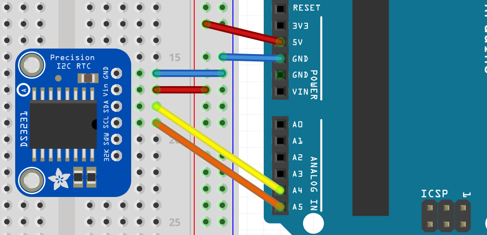

:Project: Leitura de data e hora do RTC DS3231
:Author: Douglas Navarro e Renan Yuri Lino
:Email: contato@codedecay.com.br
:Date: 21/12/2016
:Revision: 2.1
:License: Apache 2.0

= Projeto: {Project}

Neste exercício vamos aprender a ler as informações guardadas pelo RTC.

== Passo 1: Instalação

1. Abra o arquivo Ex2.ino na Arduino IDE
2. Instale a biblioteca Sodaq_DS3231 através do gerenciador de bibliotecas

== Passo 2: Montagem do circuito

Faça a montagem do RTC conforme o diagrama:

== Passo 3: Upload do código

1. Faça o upload do programa para sua placa

=== Estrutura de arquivos

....
 Ex2                    => Pasta do sketch Arduino
  ├── Ex2.ino           => Arquivo principal do sketch
  ├── rtc-schm.png      => Esquemático do RTC
  └── ReadMe.adoc       => Este arquivo
....

=== Licença
Este projeto está publicado com a licença {License}.

=== Contribuindo
Para contribuir com este projeto, entre em contato com {Author} <{Email}>

=== Lista de Materiais

|===
| ID | Nome do componente  | Quantidade
| U1 | Módulo RTC DS3231   | 1
| A1 | Arduino UNO         | 1
| J1 | Jumper macho-macho  | 6
|===

=== Help
This document is written in the _AsciiDoc_ format, a markup language to describe documents.
If you need help you can search the http://www.methods.co.nz/asciidoc[AsciiDoc homepage]
or consult the http://powerman.name/doc/asciidoc[AsciiDoc cheatsheet]
