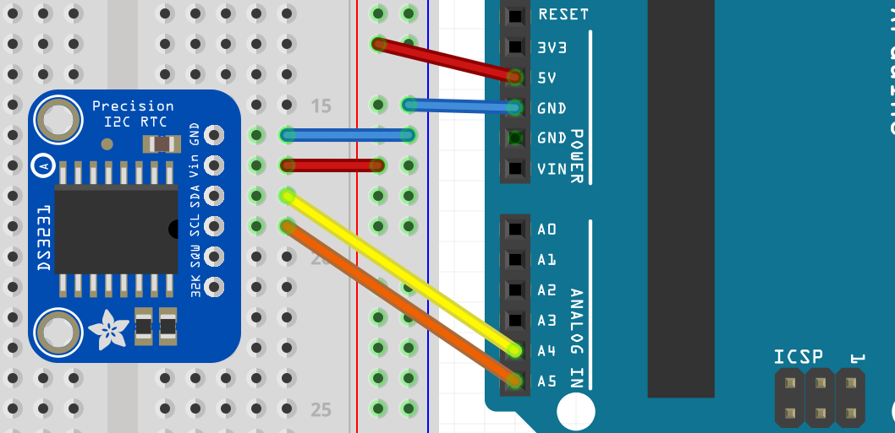
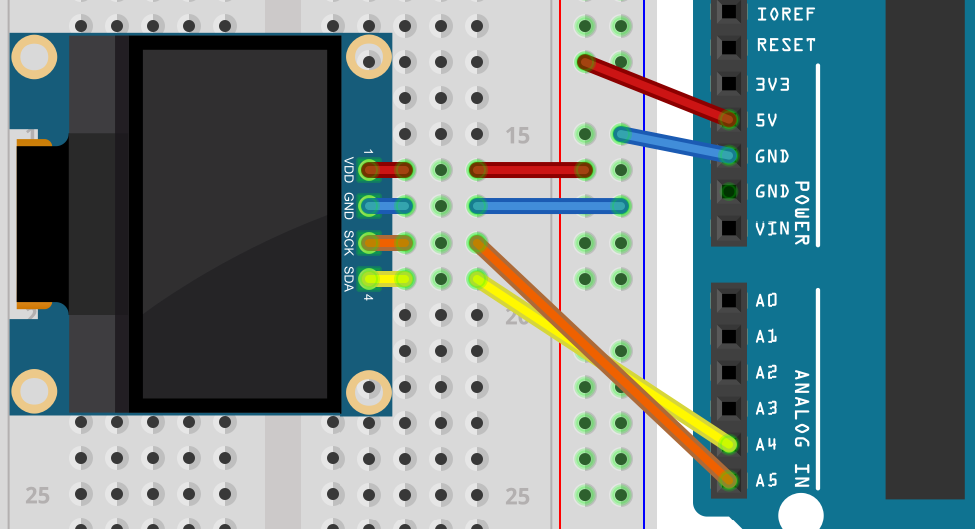

:Project: Hello World do display OLED
:Author: Douglas Navarro e Renan Yuri Lino
:Email: contato@codedecay.com.br
:Date: 21/12/2016
:Revision: 2.1
:License: Apache 2.0

= Projeto: {Project}

== Passo 1: Instalação

1. Abra o arquivo Ex3.ino na Arduino IDE
2. Instale a biblioteca Sodaq_DS3231 através do gerenciador de bibliotecas
3. Instale a biblioteca U8g2 através do gerenciador de bibliotecas

== Passo 2: Montagem do circuito

Faça a montagem do RTC conforme o diagrama:

Faça a montagem do OLED conforme o diagrama:

== Passo 3: Upload do código

1. Faça o upload do programa para sua placa

=== Estrutura de arquivos

....
 Ex3                    => Pasta do sketch Arduino
  ├── Ex3.ino           => Arquivo principal do sketch
  ├── rtc-schm.png      => Esquemático do RTC
  ├── oled-schm.png     => Esquemático do OLED
  └── ReadMe.adoc       => Este arquivo
....

=== Licença
Este projeto está publicado com a licença {License}.

=== Contribuindo
Para contribuir com este projeto, entre em contato com {Author} <{Email}>

=== BOM

|===
| ID | Nome do componente       | Quantidade
| U1 | Módulo RTC DS3231        | 1  
| U2 | Display OLED 0.96" I2C   | 1
| A1 | Arduino UNO              | 1        
| J1 | Jumper macho-macho       | 4        
|===

=== Help
This document is written in the _AsciiDoc_ format, a markup language to describe documents. 
If you need help you can search the http://www.methods.co.nz/asciidoc[AsciiDoc homepage]
or consult the http://powerman.name/doc/asciidoc[AsciiDoc cheatsheet]